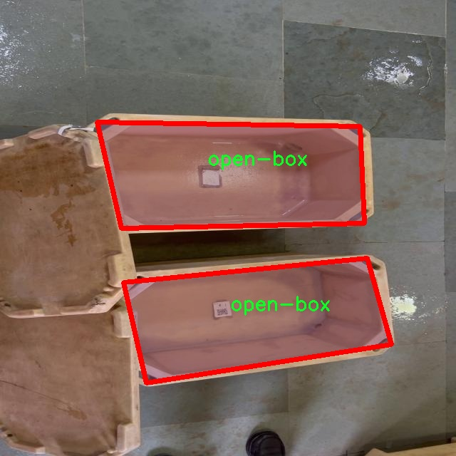

# 改进yolo11-SCConv等200+全套创新点大全：包装开闭状态检测图像分割系统源码＆数据集全套

### 1.图片效果展示


##### 项目来源 **[人工智能促进会 2024.11.01](https://kdocs.cn/l/cszuIiCKVNis)**

注意：由于项目一直在更新迭代，上面“1.图片效果展示”和“2.视频效果展示”展示的系统图片或者视频可能为老版本，新版本在老版本的基础上升级如下：（实际效果以升级的新版本为准）

  （1）适配了YOLOV11的“目标检测”模型和“实例分割”模型，通过加载相应的权重（.pt）文件即可自适应加载模型。

  （2）支持“图片识别”、“视频识别”、“摄像头实时识别”三种识别模式。

  （3）支持“图片识别”、“视频识别”、“摄像头实时识别”三种识别结果保存导出，解决手动导出（容易卡顿出现爆内存）存在的问题，识别完自动保存结果并导出到tempDir中。

  （4）支持Web前端系统中的标题、背景图等自定义修改。

  另外本项目提供训练的数据集和训练教程,暂不提供权重文件（best.pt）,需要您按照教程进行训练后实现图片演示和Web前端界面演示的效果。

### 2.视频效果展示

[2.1 视频效果展示](https://www.bilibili.com/video/BV1bvDwYsE6H/)

### 3.背景

研究背景与意义

随着电子商务的迅猛发展，包装物流行业面临着日益增长的需求，如何高效、准确地对包装状态进行监测与管理成为了一个亟待解决的问题。传统的人工检查方法不仅耗时耗力，而且容易受到人为因素的影响，导致检测结果的不准确。因此，基于计算机视觉的自动化检测系统应运而生，成为提升包装管理效率的重要手段。YOLO（You Only Look Once）系列模型以其高效的实时目标检测能力，在图像处理领域得到了广泛应用。特别是YOLOv11，凭借其更高的准确率和更快的处理速度，成为了包装状态检测的理想选择。

本研究旨在基于改进的YOLOv11模型，构建一个针对包装开闭状态的图像分割系统。通过对1200张图像的深度学习训练，该系统能够有效识别和分类“closed-box”（闭合包装）和“open-box”（开口包装）两种状态，进而实现对包装状态的实时监测与分析。数据集中仅包含一类目标，简化了模型的训练过程，使得系统在特定场景下的检测精度得以提升。此外，随着智能物流的不断发展，如何在复杂环境中保持高效的检测能力也成为了研究的重点。

通过本项目的实施，不仅能够提升包装状态检测的自动化水平，还能为物流行业提供更为精准的数据支持，进而优化包装管理流程，降低人工成本，提高整体运营效率。该系统的成功应用将为未来的智能包装解决方案奠定基础，推动物流行业的数字化转型，具有重要的理论意义和实际应用价值。

### 4.数据集信息展示

##### 4.1 本项目数据集详细数据（类别数＆类别名）

nc: 3
names: ['closed-box', 'open-box', 'packets']


该项目为【图像分割】数据集，请在【训练教程和Web端加载模型教程（第三步）】这一步的时候按照【图像分割】部分的教程来训练

##### 4.2 本项目数据集信息介绍

本项目数据集信息介绍

本项目所使用的数据集名为“PacketCounter”，旨在为改进YOLOv11的包装开闭状态检测图像分割系统提供支持。该数据集专注于包装状态的准确识别与分类，包含三种主要类别：闭合包装（closed-box）、开放包装（open-box）和散装物品（packets）。通过对这些类别的细致划分，数据集能够有效地训练模型，以便在实际应用中实现对不同包装状态的精准检测。

“PacketCounter”数据集的构建过程涵盖了多种场景和环境，以确保模型在各种情况下的鲁棒性。数据集中包含的图像不仅具有多样的背景和光照条件，还涵盖了不同类型和尺寸的包装，确保模型能够适应现实世界中复杂的视觉信息。每一类图像都经过精心标注，确保每个对象的边界清晰可辨，为后续的图像分割任务提供了高质量的训练数据。

在数据集的使用过程中，研究团队将利用这些图像进行深度学习模型的训练与验证，特别是针对YOLOv11的改进版本。通过不断优化模型的参数和结构，期望在检测精度和速度上实现显著提升。数据集的多样性和丰富性为模型的泛化能力提供了保障，使其能够在不同的应用场景中表现出色。

总之，“PacketCounter”数据集不仅为本项目的研究提供了坚实的基础，也为未来在包装状态检测领域的进一步探索奠定了重要的理论和实践依据。通过对该数据集的深入分析与应用，期望能够推动包装检测技术的发展，为相关行业带来更高效的解决方案。





### 5.全套项目环境部署视频教程（零基础手把手教学）

[5.1 所需软件PyCharm和Anaconda安装教程（第一步）](https://www.bilibili.com/video/BV1BoC1YCEKi/?spm_id_from=333.999.0.0&vd_source=bc9aec86d164b67a7004b996143742dc)


[5.2 安装Python虚拟环境创建和依赖库安装视频教程（第二步）](https://www.bilibili.com/video/BV1ZoC1YCEBw?spm_id_from=333.788.videopod.sections&vd_source=bc9aec86d164b67a7004b996143742dc)

### 6.改进YOLOv11训练教程和Web_UI前端加载模型教程（零基础手把手教学）

[6.1 改进YOLOv11训练教程和Web_UI前端加载模型教程（第三步）](https://www.bilibili.com/video/BV1BoC1YCEhR?spm_id_from=333.788.videopod.sections&vd_source=bc9aec86d164b67a7004b996143742dc)


按照上面的训练视频教程链接加载项目提供的数据集，运行train.py即可开始训练



     Epoch   gpu_mem       box       obj       cls    labels  img_size
     1/200     20.8G   0.01576   0.01955  0.007536        22      1280: 100%|██████████| 849/849 [14:42<00:00,  1.04s/it]
               Class     Images     Labels          P          R     mAP@.5 mAP@.5:.95: 100%|██████████| 213/213 [01:14<00:00,  2.87it/s]
                 all       3395      17314      0.994      0.957      0.0957      0.0843

     Epoch   gpu_mem       box       obj       cls    labels  img_size
     2/200     20.8G   0.01578   0.01923  0.007006        22      1280: 100%|██████████| 849/849 [14:44<00:00,  1.04s/it]
               Class     Images     Labels          P          R     mAP@.5 mAP@.5:.95: 100%|██████████| 213/213 [01:12<00:00,  2.95it/s]
                 all       3395      17314      0.996      0.956      0.0957      0.0845

     Epoch   gpu_mem       box       obj       cls    labels  img_size
     3/200     20.8G   0.01561    0.0191  0.006895        27      1280: 100%|██████████| 849/849 [10:56<00:00,  1.29it/s]
               Class     Images     Labels          P          R     mAP@.5 mAP@.5:.95: 100%|███████   | 187/213 [00:52<00:00,  4.04it/s]
                 all       3395      17314      0.996      0.957      0.0957      0.0845


###### [项目数据集下载链接](https://kdocs.cn/l/cszuIiCKVNis)

### 7.原始YOLOv11算法讲解

YOLOv11是Ultralytics推出的YOLO系列最新版本，专为实现尖端的物体检测而设计。其架构和训练方法上进行了重大改进，使之不仅具备卓越的准确性和处理速度，还在计算效率上实现了一场革命。得益于其改进的主干和颈部架构，YOLOv11在特征提取和处理复杂任务时表现更加出色。在2024年9月27日，Ultralytics通过长达九小时的在线直播发布这一新作，展示了其在计算机视觉领域的革新。

YOLOv11通过精细的架构设计和优化训练流程，在保持高精度的同时，缩减了参数量，与YOLOv8m相比减少了22%的参数，使其在COCO数据集上的平均准确度（mAP）有所提升。这种效率的提高使YOLOv11非常适合部署在各种硬件环境中，包括边缘设备、云计算平台以及支持NVIDIA GPU的系统，确保在灵活性上的优势。

该模型支持广泛的任务，从对象检测、实例分割到图像分类、姿态估计和定向对象检测（OBB），几乎覆盖了计算机视觉的所有主要挑战。其创新的C3k2和C2PSA模块提升了网络深度和注意力机制的应用，提高了特征提取的效率和效果。同时，YOLOv11的改进网络结构也使之在复杂视觉任务上得以从容应对，成为各类计算机视觉任务的多功能选择。这些特性令YOLOv11在实施实时物体检测的各个领域中表现出众。
* * *

2024年9月27日，Ultralytics在线直播长达九小时，为YOLO11召开“发布会”

YOLO11 是 Ultralytics YOLO 系列实时物体检测器的最新版本，它以尖端的准确性、速度和效率重新定义了可能性。在之前 YOLO
版本的显著进步的基础上，YOLO11 在架构和训练方法方面进行了重大改进，使其成为各种计算机视觉任务的多功能选择。


##### YOLO11主要特点：

  * 增强的特征提取：YOLO11 采用了改进的主干和颈部架构，增强了特征提取能力，可实现更精确的对象检测和复杂任务性能。
  * 针对效率和速度进行了优化：YOLO11 引入了完善的架构设计和优化的训练流程，可提供更快的处理速度，并在准确度和性能之间保持最佳平衡。
  * 更少的参数，更高的准确度：借助模型设计的进步，YOLO11m 在 COCO 数据集上实现了更高的平均准确度 (mAP)，同时使用的参数比 YOLOv8m 少 22%，从而提高了计算效率，同时又不影响准确度。
  * 跨环境的适应性：YOLO11 可以无缝部署在各种环境中，包括边缘设备、云平台和支持 NVIDIA GPU 的系统，从而确保最大的灵活性。
  * 支持的任务范围广泛：无论是对象检测、实例分割、图像分类、姿势估计还是定向对象检测 (OBB)，YOLO11 都旨在满足各种计算机视觉挑战。

##### 支持的任务和模式

YOLO11 以 YOLOv8 中引入的多功能模型系列为基础，为各种计算机视觉任务提供增强的支持：

Model| Filenames| Task| Inference| Validation| Training| Export  
---|---|---|---|---|---|---  
YOLO11| yolol11n.pt, yolol11s.pt, yolol11m.pt, yolol11x.pt| Detection| ✅| ✅|
✅| ✅  
YOLO11-seg| yolol11n-seg.pt, yolol11s-seg.pt, yolol11m-seg.pt,
yolol11x-seg.pt| Instance Segmentation| ✅| ✅| ✅| ✅  
YOLO11-pose| yolol11n-pose.pt, yolol11s-pose.pt, yolol11m-pose.pt,
yolol11x-pose.pt| Pose/Keypoints| ✅| ✅| ✅| ✅  
YOLO11-obb| yolol11n-obb.pt, yolol11s-obb.pt, yolol11m-obb.pt,
yolol11x-obb.pt| Oriented Detection| ✅| ✅| ✅| ✅  
YOLO11-cls| yolol11n-cls.pt, yolol11s-cls.pt, yolol11m-cls.pt,
yolol11x-cls.pt| Classification| ✅| ✅| ✅| ✅  
  
##### 简单的 YOLO11 训练和推理示例

以下示例适用于用于对象检测的 YOLO11 Detect 模型。

    
    
    from ultralytics import YOLO
    
    # Load a model
    model = YOLO("yolo11n.pt")
    
    # Train the model
    train_results = model.train(
        data="coco8.yaml",  # path to dataset YAML
        epochs=100,  # number of training epochs
        imgsz=640,  # training image size
        device="cpu",  # device to run on, i.e. device=0 or device=0,1,2,3 or device=cpu
    )
    
    # Evaluate model performance on the validation set
    metrics = model.val()
    
    # Perform object detection on an image
    results = model("path/to/image.jpg")
    results[0].show()
    
    # Export the model to ONNX format
    path = model.export(format="onnx")  # return path to exported model

##### 支持部署于边缘设备

YOLO11 专为适应各种环境而设计，包括边缘设备。其优化的架构和高效的处理能力使其适合部署在边缘设备、云平台和支持 NVIDIA GPU
的系统上。这种灵活性确保 YOLO11 可用于各种应用，从移动设备上的实时检测到云环境中的复杂分割任务。有关部署选项的更多详细信息，请参阅导出文档。

##### YOLOv11 yaml文件

    
    
    # Ultralytics YOLO 🚀, AGPL-3.0 license
    # YOLO11 object detection model with P3-P5 outputs. For Usage examples see https://docs.ultralytics.com/tasks/detect
    
    # Parameters
    nc: 80 # number of classes
    scales: # model compound scaling constants, i.e. 'model=yolo11n.yaml' will call yolo11.yaml with scale 'n'
      # [depth, width, max_channels]
      n: [0.50, 0.25, 1024] # summary: 319 layers, 2624080 parameters, 2624064 gradients, 6.6 GFLOPs
      s: [0.50, 0.50, 1024] # summary: 319 layers, 9458752 parameters, 9458736 gradients, 21.7 GFLOPs
      m: [0.50, 1.00, 512] # summary: 409 layers, 20114688 parameters, 20114672 gradients, 68.5 GFLOPs
      l: [1.00, 1.00, 512] # summary: 631 layers, 25372160 parameters, 25372144 gradients, 87.6 GFLOPs
      x: [1.00, 1.50, 512] # summary: 631 layers, 56966176 parameters, 56966160 gradients, 196.0 GFLOPs
    
    # YOLO11n backbone
    backbone:
      # [from, repeats, module, args]
      - [-1, 1, Conv, [64, 3, 2]] # 0-P1/2
      - [-1, 1, Conv, [128, 3, 2]] # 1-P2/4
      - [-1, 2, C3k2, [256, False, 0.25]]
      - [-1, 1, Conv, [256, 3, 2]] # 3-P3/8
      - [-1, 2, C3k2, [512, False, 0.25]]
      - [-1, 1, Conv, [512, 3, 2]] # 5-P4/16
      - [-1, 2, C3k2, [512, True]]
      - [-1, 1, Conv, [1024, 3, 2]] # 7-P5/32
      - [-1, 2, C3k2, [1024, True]]
      - [-1, 1, SPPF, [1024, 5]] # 9
      - [-1, 2, C2PSA, [1024]] # 10
    
    # YOLO11n head
    head:
      - [-1, 1, nn.Upsample, [None, 2, "nearest"]]
      - [[-1, 6], 1, Concat, [1]] # cat backbone P4
      - [-1, 2, C3k2, [512, False]] # 13
    
      - [-1, 1, nn.Upsample, [None, 2, "nearest"]]
      - [[-1, 4], 1, Concat, [1]] # cat backbone P3
      - [-1, 2, C3k2, [256, False]] # 16 (P3/8-small)
    
      - [-1, 1, Conv, [256, 3, 2]]
      - [[-1, 13], 1, Concat, [1]] # cat head P4
      - [-1, 2, C3k2, [512, False]] # 19 (P4/16-medium)
    
      - [-1, 1, Conv, [512, 3, 2]]
      - [[-1, 10], 1, Concat, [1]] # cat head P5
      - [-1, 2, C3k2, [1024, True]] # 22 (P5/32-large)
    
      - [[16, 19, 22], 1, Detect, [nc]] # Detect(P3, P4, P5)
    

**YOLO11和YOLOv8 yaml文件的区别**


##### 改进模块代码

  * C3k2 

    
    
    class C3k2(C2f):
        """Faster Implementation of CSP Bottleneck with 2 convolutions."""
    
        def __init__(self, c1, c2, n=1, c3k=False, e=0.5, g=1, shortcut=True):
            """Initializes the C3k2 module, a faster CSP Bottleneck with 2 convolutions and optional C3k blocks."""
            super().__init__(c1, c2, n, shortcut, g, e)
            self.m = nn.ModuleList(
                C3k(self.c, self.c, 2, shortcut, g) if c3k else Bottleneck(self.c, self.c, shortcut, g) for _ in range(n)
            )

C3k2，它是具有两个卷积的CSP（Partial Cross Stage）瓶颈架构的更快实现。

**类继承：**

  * `C3k2`继承自类`C2f`。这表明`C2f`很可能实现了经过修改的基本CSP结构，而`C3k2`进一步优化或修改了此结构。

**构造函数（`__init__`）：**

  * `c1`：输入通道。

  * `c2`：输出通道。

  * `n`：瓶颈层数（默认为1）。

  * `c3k`：一个布尔标志，确定是否使用`C3k`块或常规`Bottleneck`块。

  * `e`：扩展比率，控制隐藏层的宽度（默认为0.5）。

  * `g`：分组卷积的组归一化参数或组数（默认值为 1）。

  * `shortcut`：一个布尔值，用于确定是否在网络中包含快捷方式连接（默认值为 `True`）。

**初始化：**

  * `super().__init__(c1, c2, n, short-cut, g, e)` 调用父类 `C2f` 的构造函数，初始化标准 CSP 组件，如通道数、快捷方式、组等。

**模块列表（`self.m`）：**

  * `nn.ModuleList` 存储 `C3k` 或 `Bottleneck` 模块，具体取决于 `c3k` 的值。

  * 如果 `c3k` 为 `True`，它会初始化 `C3k` 模块。`C3k` 模块接收以下参数：

  * `self.c`：通道数（源自 `C2f`）。

  * `2`：这表示在 `C3k` 块内使用了两个卷积层。

  * `shortcut` 和 `g`：从 `C3k2` 构造函数传递。

  * 如果 `c3k` 为 `False`，则初始化标准 `Bottleneck` 模块。

`for _ in range(n)` 表示将创建 `n` 个这样的块。

**总结：**

  * `C3k2` 实现了 CSP 瓶颈架构，可以选择使用自定义 `C3k` 块（具有两个卷积）或标准 `Bottleneck` 块，具体取决于 `c3k` 标志。

  * C2PSA

    
    
    class C2PSA(nn.Module):
        """
        C2PSA module with attention mechanism for enhanced feature extraction and processing.
    
        This module implements a convolutional block with attention mechanisms to enhance feature extraction and processing
        capabilities. It includes a series of PSABlock modules for self-attention and feed-forward operations.
    
        Attributes:
            c (int): Number of hidden channels.
            cv1 (Conv): 1x1 convolution layer to reduce the number of input channels to 2*c.
            cv2 (Conv): 1x1 convolution layer to reduce the number of output channels to c.
            m (nn.Sequential): Sequential container of PSABlock modules for attention and feed-forward operations.
    
        Methods:
            forward: Performs a forward pass through the C2PSA module, applying attention and feed-forward operations.
    
        Notes:
            This module essentially is the same as PSA module, but refactored to allow stacking more PSABlock modules.
    
        Examples:
            >>> c2psa = C2PSA(c1=256, c2=256, n=3, e=0.5)
            >>> input_tensor = torch.randn(1, 256, 64, 64)
            >>> output_tensor = c2psa(input_tensor)
        """
    
        def __init__(self, c1, c2, n=1, e=0.5):
            """Initializes the C2PSA module with specified input/output channels, number of layers, and expansion ratio."""
            super().__init__()
            assert c1 == c2
            self.c = int(c1 * e)
            self.cv1 = Conv(c1, 2 * self.c, 1, 1)
            self.cv2 = Conv(2 * self.c, c1, 1)
    
            self.m = nn.Sequential(*(PSABlock(self.c, attn_ratio=0.5, num_heads=self.c // 64) for _ in range(n)))
    
        def forward(self, x):
            """Processes the input tensor 'x' through a series of PSA blocks and returns the transformed tensor."""
            a, b = self.cv1(x).split((self.c, self.c), dim=1)
            b = self.m(b)
            return self.cv2(torch.cat((a, b), 1))

`C2PSA` 模块是一个自定义神经网络层，带有注意力机制，用于增强特征提取和处理。

**类概述**

  * **目的：**

  * `C2PSA` 模块引入了一个卷积块，利用注意力机制来改进特征提取和处理。

  * 它使用一系列 `PSABlock` 模块，这些模块可能代表某种形式的位置自注意力 (PSA)，并且该架构旨在允许堆叠多个 `PSABlock` 层。

**构造函数（`__init__`）：**

  * **参数：**

  * `c1`：输入通道（必须等于 `c2`）。

  * `c2`：输出通道（必须等于 `c1`）。

  * `n`：要堆叠的 `PSABlock` 模块数量（默认值为 1）。

  * `e`：扩展比率，用于计算隐藏通道的数量（默认值为 0.5）。

  * **属性：**

  * `self.c`：隐藏通道数，计算为 `int(c1 * e)`。

  * `self.cv1`：一个 `1x1` 卷积，将输入通道数从 `c1` 减少到 `2 * self.c`。这为将输入分成两部分做好准备。

  * `self.cv2`：另一个 `1x1` 卷积，处理后将通道维度恢复回 `c1`。

  * `self.m`：一系列 `PSABlock` 模块。每个 `PSABlock` 接收 `self.c` 通道，注意头的数量为 `self.c // 64`。每个块应用注意和前馈操作。

**前向方法：**

  * **输入：**

  * `x`，输入张量。

  * **操作：**

  1. `self.cv1(x)` 应用 `1x1` 卷积，将输入通道大小从 `c1` 减小到 `2 * self.c`。

  2. 生成的张量沿通道维度分为两部分，`a` 和 `b`。

  * `a`：第一个 `self.c` 通道。

  * `b`：剩余的 `self.c` 通道。

  1. `b` 通过顺序容器 `self.m`，它是 `PSABlock` 模块的堆栈。这部分经过基于注意的处理。

  2. 处理后的张量 `b` 与 `a` 连接。

  3. `self.cv2` 应用 `1x1` 卷积，将通道大小恢复为 `c1`。

  * **输出：**

  * 应用注意和卷积操作后的变换后的张量。

**总结：**

  * **C2PSA** 是一个增强型卷积模块，它通过堆叠的 `PSABlock` 模块应用位置自注意力。它拆分输入张量，将注意力应用于其中一部分，然后重新组合并通过最终卷积对其进行处理。此结构有助于从输入数据中提取复杂特征。

##### 网络结构


### 8.200+种全套改进YOLOV11创新点原理讲解

#### 8.1 200+种全套改进YOLOV11创新点原理讲解大全

由于篇幅限制，每个创新点的具体原理讲解就不全部展开，具体见下列网址中的改进模块对应项目的技术原理博客网址【Blog】（创新点均为模块化搭建，原理适配YOLOv5~YOLOv11等各种版本）

[改进模块技术原理博客【Blog】网址链接](https://gitee.com/qunmasj/good)


#### 8.2 精选部分改进YOLOV11创新点原理讲解

###### 这里节选部分改进创新点展开原理讲解(完整的改进原理见上图和[改进模块技术原理博客链接](https://gitee.com/qunmasj/good)【如果此小节的图加载失败可以通过CSDN或者Github搜索该博客的标题访问原始博客，原始博客图片显示正常】

### RT-DETR骨干网络HGNetv2简介
#### RT-DETR横空出世
前几天被百度的RT-DETR刷屏，参考该博客提出的目标检测新范式对原始DETR的网络结构进行了调整和优化，以提高计算速度和减小模型大小。这包括使用更轻量级的基础网络和调整Transformer结构。并且，摒弃了nms处理的detr结构与传统的物体检测方法相比，不仅训练是端到端的，检测也能端到端，这意味着整个网络在训练过程中一起进行优化，推理过程不需要昂贵的后处理代价，这有助于提高模型的泛化能力和性能。


当然，人们对RT-DETR之所以产生浓厚的兴趣，我觉得大概率还是对YOLO系列审美疲劳了，就算是出到了YOLO10086，我还是只想用YOLOv11和YOLOv11的框架来魔改做业务。。

#### 初识HGNet
看到RT-DETR的性能指标，发现指标最好的两个模型backbone都是用的HGNetv2，毫无疑问，和当时的picodet一样，骨干都是使用百度自家的网络。初识HGNet的时候，当时是参加了第四届百度网盘图像处理大赛，文档图像方向识别专题赛道，简单来说，就是使用分类网络对一些文档截图或者图片进行方向角度分类。


当时的方案并没有那么快定型，通常是打榜过程发现哪个网络性能好就使用哪个网络做魔改，而且木有显卡，只能蹭Ai Studio的平台，不过v100一天8小时的实验时间有点短，这也注定了大模型用不了。 

流水的模型，铁打的炼丹人，最后发现HGNet-tiny各方面指标都很符合我们的预期，后面就一直围绕它魔改。当然，比赛打榜是目的，学习才是享受过程，当时看到效果还可以，便开始折腾起了HGNet的网络架构，我们可以看到，PP-HGNet 针对 GPU 设备，对目前 GPU 友好的网络做了分析和归纳，尽可能多的使用 3x3 标准卷积（计算密度最高），PP-HGNet是由多个HG-Block组成，细节如下：


ConvBNAct是啥？简单聊一聊，就是Conv+BN+Act，CV Man应该最熟悉不过了：
```python
class ConvBNAct(TheseusLayer):
    def __init__(self,
                 in_channels,
                 out_channels,
                 kernel_size,
                 stride,
                 groups=1,
                 use_act=True):
        super().__init__()
        self.use_act = use_act
        self.conv = Conv2D(
            in_channels,
            out_channels,
            kernel_size,
            stride,
            padding=(kernel_size - 1) // 2,
            groups=groups,
            bias_attr=False)
        self.bn = BatchNorm2D(
            out_channels,
            weight_attr=ParamAttr(regularizer=L2Decay(0.0)),
            bias_attr=ParamAttr(regularizer=L2Decay(0.0)))
        if self.use_act:
            self.act = ReLU()
 
    def forward(self, x):
        x = self.conv(x)
        x = self.bn(x)
        if self.use_act:
            x = self.act(x)
        return x 
```
且标准卷积的数量随层数深度增加而增多，从而得到一个有利于 GPU 推理的骨干网络，同样速度下，精度也超越其他 CNN ，性价比也优于ViT-base模型。


另外，我们可以看到：

PP-HGNet 的第一层由channel为96的Stem模块构成，目的是为了减少参数量和计算量。PP-HGNet

Tiny的整体结构由四个HG Stage构成，而每个HG Stage主要由包含大量标准卷积的HG Block构成。

PP-HGNet的第三到第五层使用了使用了可学习的下采样层（LDS Layer），该层group为输入通道数，可达到降参降计算量的作用，且Tiny模型仅包含三个LDS Layer，并不会对GPU的利用率造成较大影响.

PP-HGNet的激活函数为Relu，常数级操作可保证该模型在硬件上的推理速度。

### 9.系统功能展示

图9.1.系统支持检测结果表格显示

  图9.2.系统支持置信度和IOU阈值手动调节

  图9.3.系统支持自定义加载权重文件best.pt(需要你通过步骤5中训练获得)

  图9.4.系统支持摄像头实时识别

  图9.5.系统支持图片识别

  图9.6.系统支持视频识别

  图9.7.系统支持识别结果文件自动保存

  图9.8.系统支持Excel导出检测结果数据


### 10. YOLOv11核心改进源码讲解

#### 10.1 RFAConv.py

以下是代码中最核心的部分，并附上详细的中文注释：

```python
import torch
import torch.nn as nn
from einops import rearrange

# 定义h_sigmoid激活函数
class h_sigmoid(nn.Module):
    def __init__(self, inplace=True):
        super(h_sigmoid, self).__init__()
        self.relu = nn.ReLU6(inplace=inplace)  # 使用ReLU6作为基础

    def forward(self, x):
        return self.relu(x + 3) / 6  # h_sigmoid的前向传播

# 定义h_swish激活函数
class h_swish(nn.Module):
    def __init__(self, inplace=True):
        super(h_swish, self).__init__()
        self.sigmoid = h_sigmoid(inplace=inplace)  # 使用h_sigmoid作为基础

    def forward(self, x):
        return x * self.sigmoid(x)  # h_swish的前向传播

# 定义RFAConv模块
class RFAConv(nn.Module):
    def __init__(self, in_channel, out_channel, kernel_size, stride=1):
        super().__init__()
        self.kernel_size = kernel_size

        # 生成权重的网络
        self.get_weight = nn.Sequential(
            nn.AvgPool2d(kernel_size=kernel_size, padding=kernel_size // 2, stride=stride),
            nn.Conv2d(in_channel, in_channel * (kernel_size ** 2), kernel_size=1, groups=in_channel, bias=False)
        )
        
        # 生成特征的网络
        self.generate_feature = nn.Sequential(
            nn.Conv2d(in_channel, in_channel * (kernel_size ** 2), kernel_size=kernel_size, padding=kernel_size // 2, stride=stride, groups=in_channel, bias=False),
            nn.BatchNorm2d(in_channel * (kernel_size ** 2)),
            nn.ReLU()
        )
        
        # 使用自定义的卷积层
        self.conv = Conv(in_channel, out_channel, k=kernel_size, s=kernel_size, p=0)

    def forward(self, x):
        b, c = x.shape[0:2]  # 获取批量大小和通道数
        weight = self.get_weight(x)  # 计算权重
        h, w = weight.shape[2:]  # 获取特征图的高和宽
        
        # 计算softmax权重
        weighted = weight.view(b, c, self.kernel_size ** 2, h, w).softmax(2)
        feature = self.generate_feature(x).view(b, c, self.kernel_size ** 2, h, w)  # 生成特征
        
        # 加权特征
        weighted_data = feature * weighted
        conv_data = rearrange(weighted_data, 'b c (n1 n2) h w -> b c (h n1) (w n2)', n1=self.kernel_size, n2=self.kernel_size)
        
        return self.conv(conv_data)  # 返回卷积结果

# 定义SE模块（Squeeze-and-Excitation）
class SE(nn.Module):
    def __init__(self, in_channel, ratio=16):
        super(SE, self).__init__()
        self.gap = nn.AdaptiveAvgPool2d((1, 1))  # 全局平均池化
        self.fc = nn.Sequential(
            nn.Linear(in_channel, ratio, bias=False),  # 压缩通道
            nn.ReLU(),
            nn.Linear(ratio, in_channel, bias=False),  # 恢复通道
            nn.Sigmoid()  # Sigmoid激活
        )

    def forward(self, x):
        b, c = x.shape[0:2]  # 获取批量大小和通道数
        y = self.gap(x).view(b, c)  # 全局平均池化
        y = self.fc(y).view(b, c, 1, 1)  # 通过全连接层
        return y  # 返回通道注意力

# 定义RFCBAMConv模块
class RFCBAMConv(nn.Module):
    def __init__(self, in_channel, out_channel, kernel_size=3, stride=1):
        super().__init__()
        assert kernel_size % 2 == 1, "the kernel_size must be odd."  # 确保卷积核大小为奇数
        self.kernel_size = kernel_size
        
        # 生成特征的网络
        self.generate = nn.Sequential(
            nn.Conv2d(in_channel, in_channel * (kernel_size ** 2), kernel_size, padding=kernel_size // 2, stride=stride, groups=in_channel, bias=False),
            nn.BatchNorm2d(in_channel * (kernel_size ** 2)),
            nn.ReLU()
        )
        
        # 计算权重的网络
        self.get_weight = nn.Sequential(nn.Conv2d(2, 1, kernel_size=3, padding=1, bias=False), nn.Sigmoid())
        self.se = SE(in_channel)  # 实例化SE模块
        
        # 使用自定义的卷积层
        self.conv = Conv(in_channel, out_channel, k=kernel_size, s=kernel_size, p=0)

    def forward(self, x):
        b, c = x.shape[0:2]  # 获取批量大小和通道数
        channel_attention = self.se(x)  # 计算通道注意力
        generate_feature = self.generate(x)  # 生成特征

        h, w = generate_feature.shape[2:]  # 获取特征图的高和宽
        generate_feature = generate_feature.view(b, c, self.kernel_size ** 2, h, w)  # 重塑特征
        
        # 重新排列特征
        generate_feature = rearrange(generate_feature, 'b c (n1 n2) h w -> b c (h n1) (w n2)', n1=self.kernel_size, n2=self.kernel_size)
        
        # 加权特征
        unfold_feature = generate_feature * channel_attention
        max_feature, _ = torch.max(generate_feature, dim=1, keepdim=True)  # 最大特征
        mean_feature = torch.mean(generate_feature, dim=1, keepdim=True)  # 平均特征
        
        # 计算接收场注意力
        receptive_field_attention = self.get_weight(torch.cat((max_feature, mean_feature), dim=1))
        conv_data = unfold_feature * receptive_field_attention  # 加权特征
        return self.conv(conv_data)  # 返回卷积结果

# 定义RFCAConv模块
class RFCAConv(nn.Module):
    def __init__(self, inp, oup, kernel_size, stride=1, reduction=32):
        super(RFCAConv, self).__init__()
        self.kernel_size = kernel_size
        
        # 生成特征的网络
        self.generate = nn.Sequential(
            nn.Conv2d(inp, inp * (kernel_size ** 2), kernel_size, padding=kernel_size // 2, stride=stride, groups=inp, bias=False),
            nn.BatchNorm2d(inp * (kernel_size ** 2)),
            nn.ReLU()
        )
        
        # 自适应池化
        self.pool_h = nn.AdaptiveAvgPool2d((None, 1))
        self.pool_w = nn.AdaptiveAvgPool2d((1, None))

        mip = max(8, inp // reduction)  # 计算中间通道数

        # 通道压缩层
        self.conv1 = nn.Conv2d(inp, mip, kernel_size=1, stride=1, padding=0)
        self.bn1 = nn.BatchNorm2d(mip)
        self.act = h_swish()  # 使用h_swish激活
        
        # 生成注意力的卷积层
        self.conv_h = nn.Conv2d(mip, inp, kernel_size=1, stride=1, padding=0)
        self.conv_w = nn.Conv2d(mip, inp, kernel_size=1, stride=1, padding=0)
        self.conv = nn.Sequential(nn.Conv2d(inp, oup, kernel_size, stride=kernel_size))  # 最终卷积层

    def forward(self, x):
        b, c = x.shape[0:2]  # 获取批量大小和通道数
        generate_feature = self.generate(x)  # 生成特征
        h, w = generate_feature.shape[2:]  # 获取特征图的高和宽
        generate_feature = generate_feature.view(b, c, self.kernel_size ** 2, h, w)  # 重塑特征
        
        # 重新排列特征
        generate_feature = rearrange(generate_feature, 'b c (n1 n2) h w -> b c (h n1) (w n2)', n1=self.kernel_size, n2=self.kernel_size)
        
        # 计算池化特征
        x_h = self.pool_h(generate_feature)
        x_w = self.pool_w(generate_feature).permute(0, 1, 3, 2)

        y = torch.cat([x_h, x_w], dim=2)  # 拼接特征
        y = self.conv1(y)  # 通道压缩
        y = self.bn1(y)  # 批归一化
        y = self.act(y)  # 激活
        
        h, w = generate_feature.shape[2:]  # 获取特征图的高和宽
        x_h, x_w = torch.split(y, [h, w], dim=2)  # 分割特征
        x_w = x_w.permute(0, 1, 3, 2)  # 转置
        
        # 计算通道注意力
        a_h = self.conv_h(x_h).sigmoid()
        a_w = self.conv_w(x_w).sigmoid()
        return self.conv(generate_feature * a_w * a_h)  # 返回加权后的卷积结果
```

以上代码实现了多个卷积模块，主要包括RFAConv、RFCBAMConv和RFCAConv，每个模块都有其特定的功能和结构。通过自定义的激活函数和注意力机制，这些模块能够有效地提取特征并增强模型的表达能力。

该文件 `RFAConv.py` 定义了一些用于深度学习卷积操作的模块，主要包括 RFAConv、RFCBAMConv 和 RFCAConv。这些模块利用了不同的卷积和注意力机制，以增强特征提取的能力。

首先，文件中引入了 PyTorch 和一些相关的模块。`h_sigmoid` 和 `h_swish` 是自定义的激活函数，分别实现了 h-sigmoid 和 h-swish 的功能。h-sigmoid 是一种平滑的激活函数，而 h-swish 则是 h-sigmoid 和输入相乘的组合，能够在某些情况下提升模型的性能。

接下来是 `RFAConv` 类，它实现了一种基于卷积的特征生成和加权机制。该类的构造函数中定义了两个主要的子模块：`get_weight` 和 `generate_feature`。`get_weight` 通过平均池化和卷积生成权重，而 `generate_feature` 则通过卷积、批归一化和 ReLU 激活生成特征。`forward` 方法中，输入数据首先经过 `get_weight` 生成权重，然后通过 `generate_feature` 生成特征，接着将特征与权重相乘并重新排列，最后通过卷积层输出结果。

`SE` 类实现了 Squeeze-and-Excitation（SE）模块，用于增强通道间的特征表达能力。它通过全局平均池化获取特征图的全局信息，并通过全连接层生成通道注意力权重。

`RFCBAMConv` 类结合了 RFAConv 和 SE 模块，进一步增强了特征提取的能力。它在构造函数中定义了生成特征的卷积层和通道注意力机制。在 `forward` 方法中，首先计算通道注意力，然后生成特征并与通道注意力相乘，最后通过卷积层输出结果。

`RFCAConv` 类则实现了一种结合了空间和通道注意力的卷积模块。它在构造函数中定义了生成特征的卷积层和用于计算空间注意力的池化层。在 `forward` 方法中，生成特征后，分别计算水平和垂直方向的注意力，并将其应用于生成的特征，最后通过卷积层输出结果。

整体来看，这个文件中的模块通过引入注意力机制和特征加权的方法，旨在提升卷积神经网络在特征提取和表示学习方面的能力，适用于各种计算机视觉任务。

#### 10.2 rep_block.py

以下是代码中最核心的部分，并附上详细的中文注释：

```python
import torch
import torch.nn as nn
import torch.nn.functional as F

def transI_fusebn(kernel, bn):
    """
    将卷积核和批归一化层的参数融合为一个新的卷积核和偏置。
    
    参数:
    kernel: 卷积核
    bn: 批归一化层

    返回:
    融合后的卷积核和偏置
    """
    gamma = bn.weight  # 获取批归一化的缩放因子
    std = (bn.running_var + bn.eps).sqrt()  # 计算标准差
    # 返回融合后的卷积核和偏置
    return kernel * ((gamma / std).reshape(-1, 1, 1, 1)), bn.bias - bn.running_mean * gamma / std

def conv_bn(in_channels, out_channels, kernel_size, stride=1, padding=0, dilation=1, groups=1, padding_mode='zeros'):
    """
    创建一个卷积层和批归一化层的组合。

    参数:
    in_channels: 输入通道数
    out_channels: 输出通道数
    kernel_size: 卷积核大小
    stride: 步幅
    padding: 填充
    dilation: 膨胀
    groups: 分组卷积的组数
    padding_mode: 填充模式

    返回:
    包含卷积层和批归一化层的序列
    """
    conv_layer = nn.Conv2d(in_channels=in_channels, out_channels=out_channels, kernel_size=kernel_size,
                           stride=stride, padding=padding, dilation=dilation, groups=groups,
                           bias=False, padding_mode=padding_mode)  # 创建卷积层
    bn_layer = nn.BatchNorm2d(num_features=out_channels, affine=True)  # 创建批归一化层
    se = nn.Sequential()  # 创建一个顺序容器
    se.add_module('conv', conv_layer)  # 添加卷积层
    se.add_module('bn', bn_layer)  # 添加批归一化层
    return se  # 返回组合层

class DiverseBranchBlock(nn.Module):
    def __init__(self, in_channels, out_channels, kernel_size, stride=1, padding=None, dilation=1, groups=1):
        """
        初始化DiverseBranchBlock模块。

        参数:
        in_channels: 输入通道数
        out_channels: 输出通道数
        kernel_size: 卷积核大小
        stride: 步幅
        padding: 填充
        dilation: 膨胀
        groups: 分组卷积的组数
        """
        super(DiverseBranchBlock, self).__init__()
        self.kernel_size = kernel_size
        self.in_channels = in_channels
        self.out_channels = out_channels
        self.groups = groups
        
        if padding is None:
            padding = kernel_size // 2  # 自动计算填充
        
        # 创建原始卷积和批归一化层
        self.dbb_origin = conv_bn(in_channels=in_channels, out_channels=out_channels, kernel_size=kernel_size, 
                                  stride=stride, padding=padding, dilation=dilation, groups=groups)

        # 创建平均池化和批归一化层
        self.dbb_avg = nn.Sequential()
        self.dbb_avg.add_module('avg', nn.AvgPool2d(kernel_size=kernel_size, stride=stride, padding=0))
        self.dbb_avg.add_module('avgbn', nn.BatchNorm2d(out_channels))

    def forward(self, inputs):
        """
        前向传播函数。

        参数:
        inputs: 输入张量

        返回:
        输出张量
        """
        out = self.dbb_origin(inputs)  # 通过原始卷积层
        out += self.dbb_avg(inputs)  # 加上平均池化层的输出
        return out  # 返回最终输出

# 示例使用
if __name__ == "__main__":
    model = DiverseBranchBlock(in_channels=3, out_channels=16, kernel_size=3)
    x = torch.randn(1, 3, 224, 224)  # 创建一个随机输入
    output = model(x)  # 通过模型前向传播
    print(output.shape)  # 输出形状
```

### 代码说明：
1. **transI_fusebn**: 该函数用于将卷积层的权重与批归一化层的参数融合，返回融合后的卷积核和偏置。
2. **conv_bn**: 该函数创建一个包含卷积层和批归一化层的组合，方便后续使用。
3. **DiverseBranchBlock**: 这是一个自定义的神经网络模块，包含了多个分支的卷积和池化操作。其构造函数初始化了卷积层和池化层，并在前向传播中计算输出。

该代码的核心部分在于卷积和批归一化的组合，以及如何通过不同的分支来处理输入数据。

这个文件 `rep_block.py` 定义了一些用于构建深度学习模型的模块，主要集中在不同类型的卷积块上。这些卷积块通过多种方式组合不同的卷积操作，以实现更复杂的特征提取。以下是对代码的详细解释。

首先，文件导入了必要的库，包括 PyTorch 和 NumPy。接着，定义了一些辅助函数，这些函数用于处理卷积和批归一化（Batch Normalization）层的参数，进行卷积核的转换和融合等操作。

`transI_fusebn` 函数用于将卷积层的权重与批归一化层的参数融合，返回融合后的卷积核和偏置。`transII_addbranch` 函数用于将多个卷积核和偏置相加。`transIII_1x1_kxk` 函数则处理不同类型的卷积核（1x1 和 kxk）之间的转换。`transIV_depthconcat` 用于将多个卷积核和偏置在深度维度上连接。`transV_avg` 函数生成平均池化的卷积核。`transVI_multiscale` 函数用于对卷积核进行多尺度处理。

接下来，定义了一个 `conv_bn` 函数，它创建一个包含卷积层和批归一化层的序列模块。该模块的输入通道数、输出通道数、卷积核大小等参数可以灵活设置。

`IdentityBasedConv1x1` 类实现了一个带有身份映射的 1x1 卷积层。它通过构造一个身份张量，确保输入和输出的通道之间有直接的连接。`BNAndPadLayer` 类则实现了一个批归一化层，并在必要时对输入进行填充。

`DiverseBranchBlock` 类是一个复杂的卷积块，支持多种卷积操作的组合。它可以在训练和推理模式之间切换，并在推理时通过 `switch_to_deploy` 方法将多个卷积操作融合为一个卷积层。该类还支持不同的初始化策略。

`DiverseBranchBlockNOAct` 类与 `DiverseBranchBlock` 类类似，但不包含非线性激活函数。`DeepDiverseBranchBlock` 类则在 `DiverseBranchBlock` 的基础上进行了扩展，增加了更多的分支和卷积操作。`WideDiverseBranchBlock` 类则专注于实现宽卷积，使用了水平和垂直卷积的组合。

每个类都提供了获取等效卷积核和偏置的方法，以便在推理时使用。这些方法通过融合不同的卷积层和批归一化层的参数，生成最终的卷积核和偏置。

总体来说，这个文件实现了一些灵活且高效的卷积块，可以用于构建现代深度学习模型，特别是在图像处理和计算机视觉任务中。通过不同的组合和结构，这些卷积块能够提取丰富的特征，提高模型的表现。

#### 10.3 kan_conv.py

以下是代码中最核心的部分，并附上详细的中文注释：

```python
import torch
import torch.nn as nn

class KANConvNDLayer(nn.Module):
    def __init__(self, conv_class, norm_class, input_dim, output_dim, spline_order, kernel_size,
                 groups=1, padding=0, stride=1, dilation=1,
                 ndim: int = 2, grid_size=5, base_activation=nn.GELU, grid_range=[-1, 1], dropout=0.0):
        super(KANConvNDLayer, self).__init__()
        
        # 初始化输入和输出维度、卷积参数等
        self.inputdim = input_dim
        self.outdim = output_dim
        self.spline_order = spline_order
        self.kernel_size = kernel_size
        self.padding = padding
        self.stride = stride
        self.dilation = dilation
        self.groups = groups
        self.ndim = ndim
        self.grid_size = grid_size
        self.base_activation = base_activation()  # 基础激活函数
        self.grid_range = grid_range

        # 初始化 dropout 层
        self.dropout = None
        if dropout > 0:
            if ndim == 1:
                self.dropout = nn.Dropout1d(p=dropout)
            elif ndim == 2:
                self.dropout = nn.Dropout2d(p=dropout)
            elif ndim == 3:
                self.dropout = nn.Dropout3d(p=dropout)

        # 检查 groups 参数的有效性
        if groups <= 0:
            raise ValueError('groups must be a positive integer')
        if input_dim % groups != 0:
            raise ValueError('input_dim must be divisible by groups')
        if output_dim % groups != 0:
            raise ValueError('output_dim must be divisible by groups')

        # 创建基础卷积层和样条卷积层
        self.base_conv = nn.ModuleList([conv_class(input_dim // groups,
                                                   output_dim // groups,
                                                   kernel_size,
                                                   stride,
                                                   padding,
                                                   dilation,
                                                   groups=1,
                                                   bias=False) for _ in range(groups)])

        self.spline_conv = nn.ModuleList([conv_class((grid_size + spline_order) * input_dim // groups,
                                                     output_dim // groups,
                                                     kernel_size,
                                                     stride,
                                                     padding,
                                                     dilation,
                                                     groups=1,
                                                     bias=False) for _ in range(groups)])

        # 创建归一化层和激活层
        self.layer_norm = nn.ModuleList([norm_class(output_dim // groups) for _ in range(groups)])
        self.prelus = nn.ModuleList([nn.PReLU() for _ in range(groups)])

        # 生成样条网格
        h = (self.grid_range[1] - self.grid_range[0]) / grid_size
        self.grid = torch.linspace(
            self.grid_range[0] - h * spline_order,
            self.grid_range[1] + h * spline_order,
            grid_size + 2 * spline_order + 1,
            dtype=torch.float32
        )

        # 使用 Kaiming 均匀分布初始化卷积层权重
        for conv_layer in self.base_conv:
            nn.init.kaiming_uniform_(conv_layer.weight, nonlinearity='linear')

        for conv_layer in self.spline_conv:
            nn.init.kaiming_uniform_(conv_layer.weight, nonlinearity='linear')

    def forward_kan(self, x, group_index):
        # 对输入应用基础激活函数并进行线性变换
        base_output = self.base_conv[group_index](self.base_activation(x))

        x_uns = x.unsqueeze(-1)  # 扩展维度以进行样条操作
        target = x.shape[1:] + self.grid.shape
        grid = self.grid.view(*list([1 for _ in range(self.ndim + 1)] + [-1, ])).expand(target).contiguous().to(x.device)

        # 计算样条基
        bases = ((x_uns >= grid[..., :-1]) & (x_uns < grid[..., 1:])).to(x.dtype)

        # 计算多阶样条基
        for k in range(1, self.spline_order + 1):
            left_intervals = grid[..., :-(k + 1)]
            right_intervals = grid[..., k:-1]
            delta = torch.where(right_intervals == left_intervals, torch.ones_like(right_intervals),
                                right_intervals - left_intervals)
            bases = ((x_uns - left_intervals) / delta * bases[..., :-1]) + \
                    ((grid[..., k + 1:] - x_uns) / (grid[..., k + 1:] - grid[..., 1:(-k)]) * bases[..., 1:])
        bases = bases.contiguous()
        bases = bases.moveaxis(-1, 2).flatten(1, 2)
        
        # 通过样条卷积层进行前向传播
        spline_output = self.spline_conv[group_index](bases)
        x = self.prelus[group_index](self.layer_norm[group_index](base_output + spline_output))

        # 应用 dropout
        if self.dropout is not None:
            x = self.dropout(x)

        return x

    def forward(self, x):
        # 将输入拆分为多个组
        split_x = torch.split(x, self.inputdim // self.groups, dim=1)
        output = []
        for group_ind, _x in enumerate(split_x):
            y = self.forward_kan(_x.clone(), group_ind)  # 对每个组进行前向传播
            output.append(y.clone())
        y = torch.cat(output, dim=1)  # 合并输出
        return y
```

### 代码核心部分说明：
1. **类定义**：`KANConvNDLayer` 是一个自定义的神经网络层，支持多维卷积（1D、2D、3D）。
2. **初始化方法**：构造函数中初始化了卷积层、归一化层、激活函数、样条网格等，并进行了必要的参数检查。
3. **前向传播方法**：`forward_kan` 方法实现了样条卷积的前向传播逻辑，包括样条基的计算和最终输出的生成。
4. **组处理**：`forward` 方法将输入数据分成多个组，分别通过 `forward_kan` 进行处理，并将结果合并。

这个程序文件定义了一个名为 `KANConvNDLayer` 的神经网络层，主要用于实现一种基于样条（spline）插值的卷积操作。该层可以处理不同维度的数据（如1D、2D和3D），并且提供了灵活的参数配置。文件中还定义了三个特定维度的卷积层类：`KANConv1DLayer`、`KANConv2DLayer` 和 `KANConv3DLayer`，它们分别继承自 `KANConvNDLayer`。

在 `KANConvNDLayer` 的构造函数中，首先对输入参数进行初始化，包括输入和输出维度、卷积核大小、样条阶数、分组数、填充、步幅、扩张率等。构造函数还检查了一些参数的有效性，比如分组数必须为正整数，并且输入和输出维度必须能够被分组数整除。

接下来，构造函数创建了多个卷积层和归一化层。`base_conv` 和 `spline_conv` 是两个模块列表，分别用于基本卷积和样条卷积。`layer_norm` 列表用于对每个分组的输出进行归一化处理，`prelus` 列表则用于应用 PReLU 激活函数。

在 `forward_kan` 方法中，首先对输入进行基本卷积操作，然后计算样条基函数。样条基函数的计算涉及到输入值与预定义网格的比较，生成一个表示样条的基矩阵。接着，通过样条卷积层处理这些基矩阵，并将结果与基本卷积的输出相加，经过归一化和激活函数处理后得到最终输出。如果设置了 dropout，则在输出前应用 dropout 操作。

`forward` 方法负责处理输入数据的分组，针对每个分组调用 `forward_kan` 方法进行处理，最后将所有分组的输出拼接在一起，形成最终的输出。

对于 `KANConv3DLayer`、`KANConv2DLayer` 和 `KANConv1DLayer`，它们分别调用 `KANConvNDLayer` 的构造函数，指定对应的卷积类（`nn.Conv3d`、`nn.Conv2d` 和 `nn.Conv1d`）和归一化类（`nn.InstanceNorm3d`、`nn.InstanceNorm2d` 和 `nn.InstanceNorm1d`），从而实现特定维度的卷积操作。

整体来看，这个程序文件实现了一种灵活且强大的卷积层，结合了样条插值和深度学习中的常见技术，如归一化和激活函数，适用于多维数据的处理。

#### 10.4 test_selective_scan.py

以下是代码中最核心的部分，并附上详细的中文注释：

```python
import torch
import torch.nn.functional as F

def build_selective_scan_fn(selective_scan_cuda: object = None, mode="mamba_ssm"):
    """
    构建选择性扫描函数的工厂函数。
    
    参数:
    selective_scan_cuda: 用于CUDA加速的选择性扫描实现。
    mode: 选择性扫描的模式。
    
    返回:
    selective_scan_fn: 构建的选择性扫描函数。
    """
    
    class SelectiveScanFn(torch.autograd.Function):
        @staticmethod
        def forward(ctx, u, delta, A, B, C, D=None, z=None, delta_bias=None, delta_softplus=False, return_last_state=False):
            """
            前向传播函数。
            
            参数:
            ctx: 上下文对象，用于保存信息以供反向传播使用。
            u: 输入张量。
            delta: 变化率张量。
            A, B, C: 参与计算的权重张量。
            D: 可选的偏置张量。
            z: 可选的张量。
            delta_bias: 可选的变化率偏置。
            delta_softplus: 是否使用softplus激活。
            return_last_state: 是否返回最后的状态。
            
            返回:
            out: 输出张量。
            last_state: 最后状态（如果return_last_state为True）。
            """
            # 确保输入张量是连续的
            if u.stride(-1) != 1:
                u = u.contiguous()
            if delta.stride(-1) != 1:
                delta = delta.contiguous()
            if D is not None:
                D = D.contiguous()
            if B.stride(-1) != 1:
                B = B.contiguous()
            if C.stride(-1) != 1:
                C = C.contiguous()
            if z is not None and z.stride(-1) != 1:
                z = z.contiguous()

            # 确保输入的形状是正确的
            assert u.shape[1] % (B.shape[1] * nrows) == 0 
            assert nrows in [1, 2, 3, 4]

            # 调用CUDA实现的前向函数
            out, x, *rest = selective_scan_cuda.fwd(u, delta, A, B, C, D, z, delta_bias, delta_softplus)

            # 保存用于反向传播的张量
            ctx.save_for_backward(u, delta, A, B, C, D, delta_bias, x)

            # 返回输出
            last_state = x[:, :, -1, 1::2]  # 获取最后状态
            return out if not return_last_state else (out, last_state)

        @staticmethod
        def backward(ctx, dout):
            """
            反向传播函数。
            
            参数:
            ctx: 上下文对象，包含前向传播时保存的信息。
            dout: 输出的梯度。
            
            返回:
            梯度的元组，包含u, delta, A, B, C, D, z, delta_bias的梯度。
            """
            # 从上下文中恢复前向传播时保存的张量
            u, delta, A, B, C, D, delta_bias, x = ctx.saved_tensors
            
            # 调用CUDA实现的反向函数
            du, ddelta, dA, dB, dC, dD, ddelta_bias, *rest = selective_scan_cuda.bwd(
                u, delta, A, B, C, D, delta_bias, dout, x, ctx.delta_softplus
            )

            return (du, ddelta, dA, dB, dC, dD if D is not None else None, None, ddelta_bias if delta_bias is not None else None)

    def selective_scan_fn(u, delta, A, B, C, D=None, z=None, delta_bias=None, delta_softplus=False, return_last_state=False):
        """
        封装选择性扫描函数的调用。
        """
        return SelectiveScanFn.apply(u, delta, A, B, C, D, z, delta_bias, delta_softplus, return_last_state)

    return selective_scan_fn
```

### 代码核心部分说明：

1. **`build_selective_scan_fn` 函数**: 这是一个工厂函数，用于构建选择性扫描的函数。它接受一个CUDA实现和模式参数，并返回一个选择性扫描函数。

2. **`SelectiveScanFn` 类**: 这个类继承自 `torch.autograd.Function`，实现了前向和反向传播的逻辑。

   - **`forward` 方法**: 处理前向传播的计算，接收输入张量并进行必要的形状和连续性检查，调用CUDA实现的前向函数，并保存必要的张量以供反向传播使用。

   - **`backward` 方法**: 处理反向传播的计算，恢复前向传播时保存的张量，调用CUDA实现的反向函数，并返回各个输入的梯度。

3. **`selective_scan_fn` 函数**: 封装了对 `SelectiveScanFn` 的调用，提供了一个简单的接口供外部使用。

通过以上代码，用户可以利用选择性扫描的功能，进行高效的张量计算，同时利用PyTorch的自动求导机制进行反向传播。

这个程序文件 `test_selective_scan.py` 是一个用于测试选择性扫描（Selective Scan）操作的 PyTorch 实现。文件中包含了多个函数和类，主要功能是实现和测试选择性扫描的前向和反向传播过程。

首先，文件导入了必要的库，包括 `torch` 和 `pytest`，以及一些用于处理张量的函数和工具。接着，定义了一个名为 `build_selective_scan_fn` 的函数，该函数用于构建选择性扫描的前向和反向传播函数。这个函数接受一个 CUDA 实现的选择性扫描函数和其他参数，并返回一个可以在 PyTorch 中使用的函数。

在 `build_selective_scan_fn` 中，定义了一个名为 `SelectiveScanFn` 的类，继承自 `torch.autograd.Function`。这个类实现了选择性扫描的前向和反向传播逻辑。在前向传播中，首先对输入的张量进行处理，确保它们是连续的，并根据不同的模式调用相应的 CUDA 函数进行计算。计算结果会被保存以供反向传播使用。

反向传播部分则会根据前向传播时保存的上下文（`ctx`）来计算梯度。它会调用相应的 CUDA 函数来获取梯度，并处理可能的类型转换和维度调整。

接下来，定义了两个参考实现的选择性扫描函数 `selective_scan_ref` 和 `selective_scan_ref_v2`，它们用于在 CPU 上执行选择性扫描的计算，以便与 CUDA 实现的结果进行比较。这两个函数的输入参数与前面的函数相似，主要是处理输入张量，执行选择性扫描的计算，并返回结果。

在文件的后半部分，定义了一个测试函数 `test_selective_scan`，使用 `pytest` 框架进行参数化测试。这个测试函数会根据不同的输入参数组合生成随机张量，并调用选择性扫描的实现和参考实现进行比较。它会检查输出结果和梯度是否在可接受的误差范围内，以验证 CUDA 实现的正确性。

最后，文件中包含了一些用于选择不同模式的代码，这些模式决定了选择性扫描的具体实现。根据不同的模式，程序会导入相应的 CUDA 实现，并构建选择性扫描函数。

总体而言，这个程序文件实现了选择性扫描的高效计算，并通过测试确保其正确性，适用于需要高性能计算的深度学习任务。

注意：由于此博客编辑较早，上面“10.YOLOv11核心改进源码讲解”中部分代码可能会优化升级，仅供参考学习，以“11.完整训练+Web前端界面+200+种全套创新点源码、数据集获取”的内容为准。

### 11.完整训练+Web前端界面+200+种全套创新点源码、数据集获取


# [下载链接：https://mbd.pub/o/bread/Zp6ampZy](https://mbd.pub/o/bread/Zp6ampZy)